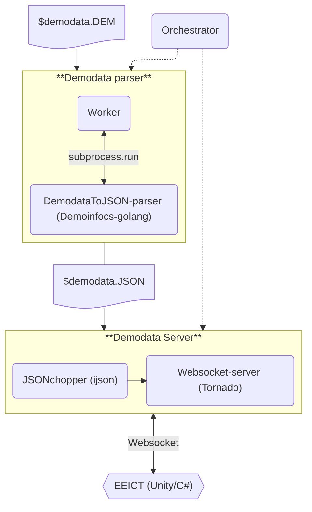

# Transferring CS2 Demo Data to the EEICS2 Application (WIP)

Application architecture of the backend described from a developer's perspective.
## Architecture Description

## Component Responsibilities

#### Orchestrator

- Responsibility: managing the transfer of demo data between components.
- Programming language: Python

### Demodata parser

Takes a demo data file (*.dem) produced by Counter Strike 2 as input and generates a JSON file suitable for use in the EEICT application.

#### Worker

- Responsibility: managing the transfer of demo data through the parser.
- Programming language: Python

#### DemodataToJSON parser

- Responsibility: parses the demo data produced by CS2 into JSON format.
- Programming language: Go
- Utilizes library: Demoinfocs-golang ([https://github.com/markus-wa/demoinfocs-golang](https://github.com/markus-wa/demoinfocs-golang))
- Saves the parsed JSON data in a file with the same name as the source file.
- Option to define the number of events per second to be included in the JSON file.
    - CS2 supports a maximum of 64/128 events per second, depending on CS2 server settings.
    - Writes the defined interval into the JSON file.

### Demodata Server

Takes the JSON file produced by the parser as input and sends it object by object using the websocket protocol. Also functions as a standalone application executable on the developer's machine.

#### JSONchopper

- Responsibility: splits the JSON file into individual objects for transfer to the EEICT application.
- Programming language: Python
- Reads the JSON file from the parser into memory.
- Transfers the data from the JSON file one object at a time, using the previously defined events-per-second interval, to the next component.
- Utilizes library: Ijson ([https://pypi.org/project/ijson/](https://pypi.org/project/ijson/))

#### Websocket-server

- Responsibility: establishes a connection between the backend and the EEICT application using the websocket protocol.
- Transfers data received from JSONchopper at the previously defined events-per-second interval (example: 64 e/s = 15.625ms)
- Programming language: Python
- Utilizes library: Tornado ([https://www.tornadoweb.org/en/stable/](https://www.tornadoweb.org/en/stable/))